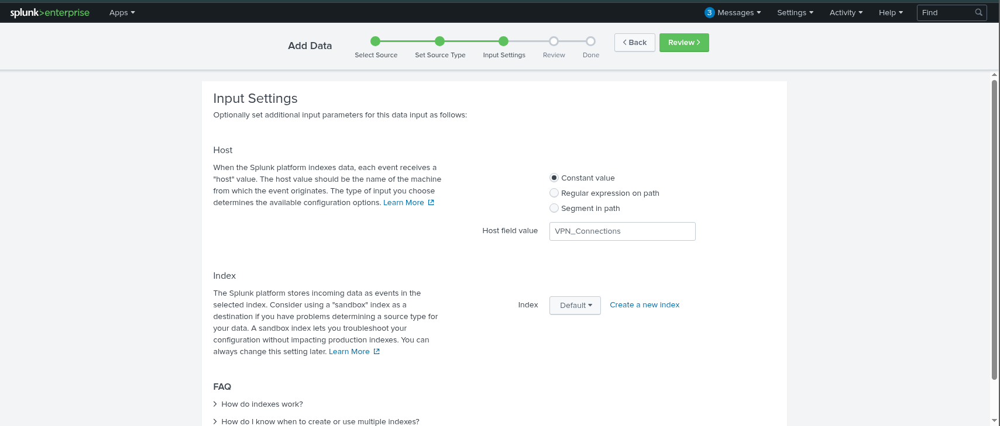
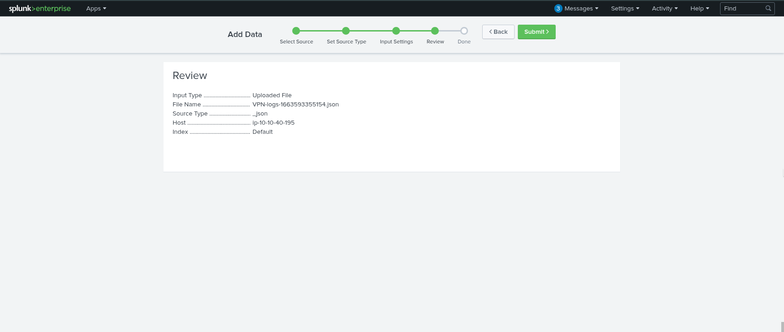
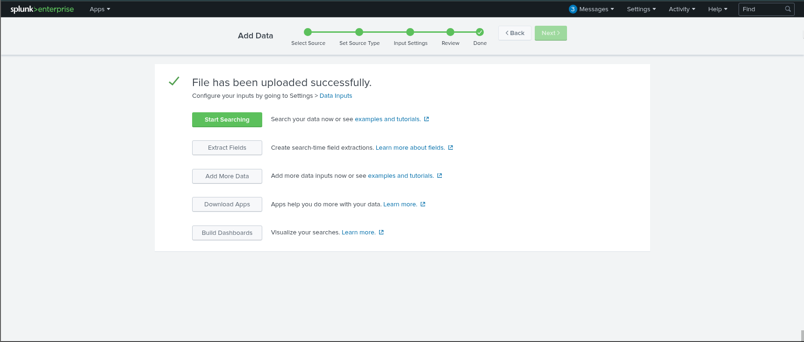
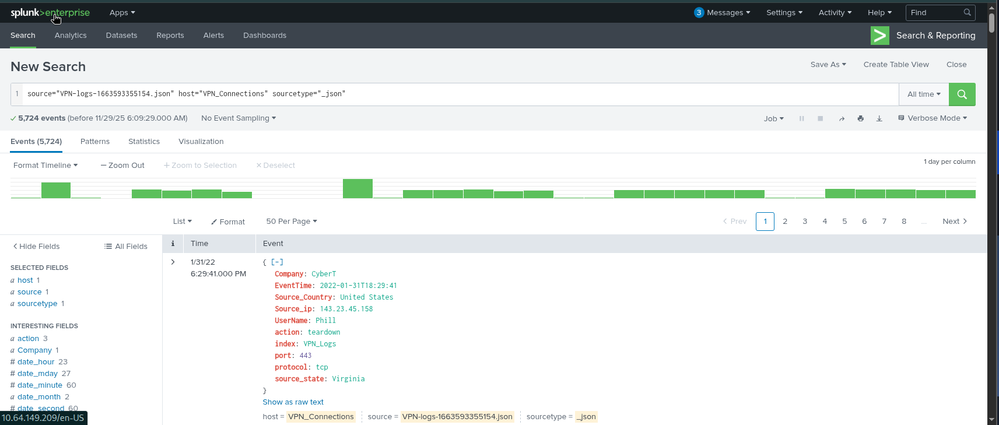

# Splunk Basics 

# Overview  
This project walks through how Splunk ingests and searches log data. The goal is to cover the main Splunk components and the basic workflow of uploading and analyzing logs using the provided VPN data.

---

## 1. Objective  
Build a baseline understanding of Splunk by going through a simple end-to-end ingestion flow using the “Add Data → Upload” method.

---

## 2. Splunk Architecture

### Forwarder  
A lightweight agent that runs on endpoints and sends their logs into Splunk.
Common examples include:
- Web server logs
- Windows Event Logs, Sysmon, PowerShell
- Linux system logs
- Database activity logs

### Indexer  
Receives logs from forwarders and turns them into searchable events.
It handles:
- Parsing  
- Extracting fields
- Normalizing data
- Storing events

### Search Head  
The interface where analysts run queries using SPL (Search Processing Language).
From here you can:
- Search indexed data 
- View results in tables or basic visualizations 
- Build dashboards 
- Review past searches

---

## 3. Splunk Interface Overview

### Splunk Bar  
Top navigation bar with access to:
- Messages  
- Settings  
- Activity (search job history)  
- Help  
- Global Search (Find)  
- App switcher  

### Apps Panel  
Shows installed apps. The main one used for this project is Search & Reporting.

### Explore Splunk Panel  
Quick-access area for:
- Adding data  
- Installing or browsing apps
- Opening Splunk documentation

### Home Dashboard  
A customizable starting page where users can pin useful dashboards or create their own.

---

## 4. Hands-On: Uploading VPN Logs

This section covers the exact steps used to ingest the `VPN_logs` file into Splunk using the “Add Data → Upload” workflow.

### Step 1: Select Source  
- Upload the log file from the local machine  
- Splunk loads the file and prepares it for processing  

### Step 2: Select Source Type  
Splunk attempts to detect the correct log format (JSON in this case).  
You can also adjust the source type manually if needed.

### Step 3: Input Settings  
Configure the basic metadata for the ingestion:
- Choose which **index** the events should be stored in  
- Set the **host** value Splunk will associate with these events  

### Step 4: Review  
A final check before ingestion.  
You can go back and adjust any settings if something looks off.

### Step 5: Done  
Splunk finishes indexing the file.  
Once complete, the events are fully searchable using SPL.

---

## 5. Key Takeaways

- Splunk’s core workflow is simple: **Forwarder → Indexer → Search Head**  
- Forwarders gather logs without putting extra load on endpoints  
- Indexers parse, extract fields, and store events  
- The Search Head is where analysts run SPL queries and visualize results  
- Splunk can ingest almost any log source (VPN, Windows, Sysmon, firewall, web traffic, etc.)  
- This project demonstrates the full workflow from file upload to running the first SPL search

---

## 6. Splunk Ingestion Workflow (Visual Walkthrough)

### Splunk Home Screen

### Add Data → Upload Screen

### Upload Screen (Method Selection)

### Source Type Selection

### Parsed Event Preview (JSON)

### Input Settings (Index + Host Assignment)

### Review Step (Before Upload)

### Upload Complete / Data Summary

### First SPL Search Against the Ingested Logs

