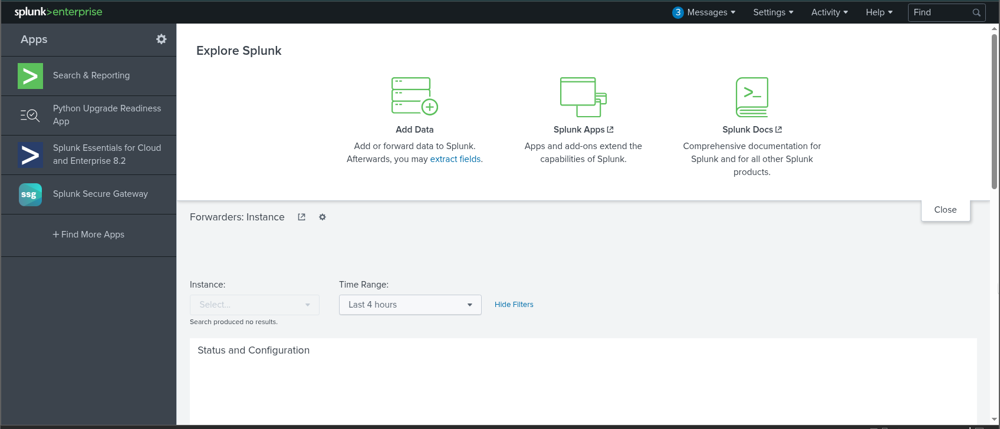
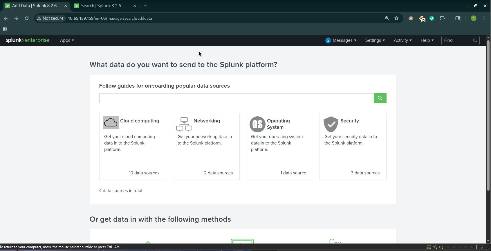
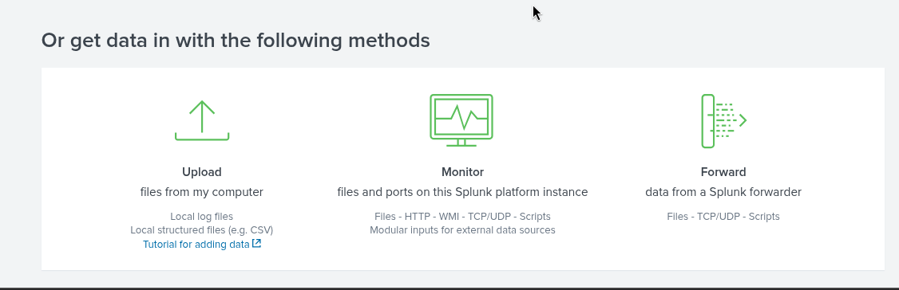
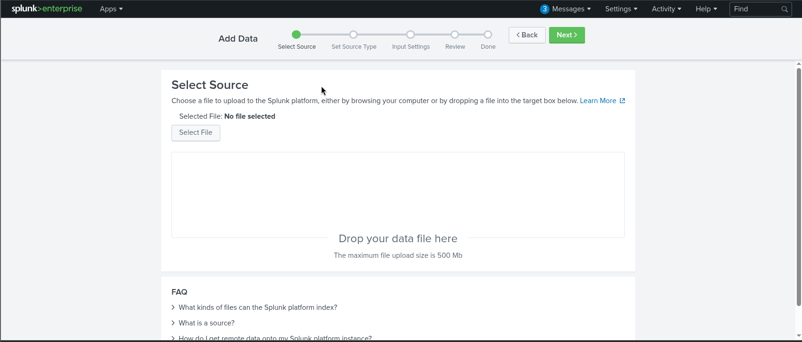
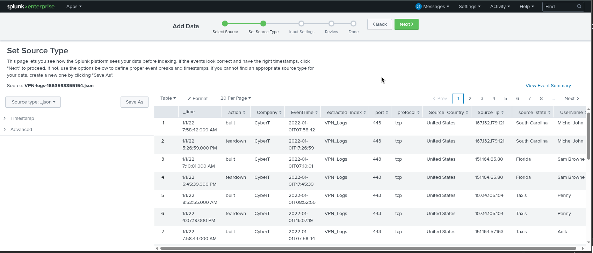

# Splunk Basics 

# Overview  
This project demonstrates how Splunk ingests, indexes, and searches log data. It covers Splunk’s core components, the user interface, and hands-on data ingestion using the provided VPN logs.

---

## 1. Objective  
Gain foundational SIEM skills by understanding Splunk architecture and performing a full log-ingestion workflow using the "Add Data → Upload" method.

---

## 2. Splunk Architecture

### Forwarder  
A lightweight agent installed on endpoints that collects logs and sends them to the Indexer.  
Typical data sources:
- Web server logs  
- Windows Event Logs, Sysmon, PowerShell  
- Linux host logs  
- Database logs  

### Indexer  
Processes and stores incoming data as searchable events.  
Key functions:
- Parsing  
- Normalization into field=value pairs  
- Categorization  
- Event storage  

### Search Head  
Interface used to query indexed data using SPL (Search Processing Language).  
Capabilities:
- Execute SPL searches  
- Display results as tables or visualizations  
- Create dashboards  
- Manage search jobs and saved searches  

---

## 3. Splunk Interface Overview

### Splunk Bar  
Top navigation panel providing:
- Messages  
- Settings  
- Activity (search job history)  
- Help  
- Global Search (Find)  
- App switcher  

### Apps Panel  
Displays installed Splunk apps.  
Default: Search & Reporting.

### Explore Splunk Panel  
Quick-access area for:
- Adding data  
- Installing apps  
- Accessing documentation  

### Home Dashboard  
Customizable dashboard area.  
Users can add prebuilt dashboards or create their own.

---

## 4. Hands-On: Uploading VPN Logs

The following steps were used to ingest the `VPN_logs` file:

### Step 1: Select Source  
- Upload the log file from the local system  
- Provide source identification  

### Step 2: Select Source Type  
Choose the format of the ingested logs (e.g., syslog, JSON).

### Step 3: Input Settings  
Configure:
- Index used for storage  
- Host metadata  

### Step 4: Review  
Verify all selections prior to ingestion.

### Step 5: Done  
Splunk indexes the data and makes it available for SPL queries.

---

## 5. Key Takeaways

- Splunk follows a simple data flow: Forwarder → Indexer → Search Head  
- Forwarders collect logs without impacting endpoint performance  
- Indexers transform logs into searchable events  
- The Search Head allows analysts to query and visualize data  
- Any log source (VPN, Windows, Sysmon, firewall, web, etc.) can be ingested  
- The project demonstrates the complete ingestion workflow from file upload to indexed events

---

## 6. Screenshot Placeholders  
(screenshots to be added)  
Splunk Home Screen  
  
Add Data → Upload Screen  
  
  
Source Type Selection  
  
  
Input Settings (Index + Host Assignment)  
Review Step (Before Upload)  
Upload Complete / Data Summary  
First SPL Search Against the Ingested Logs  
