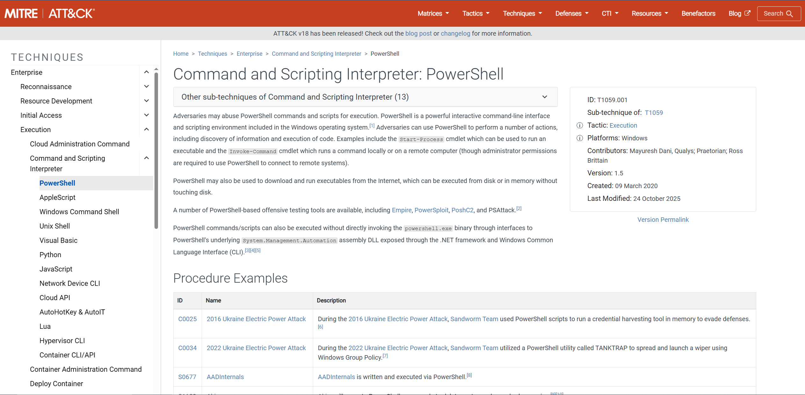
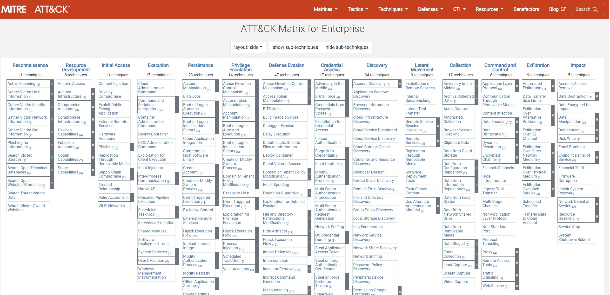
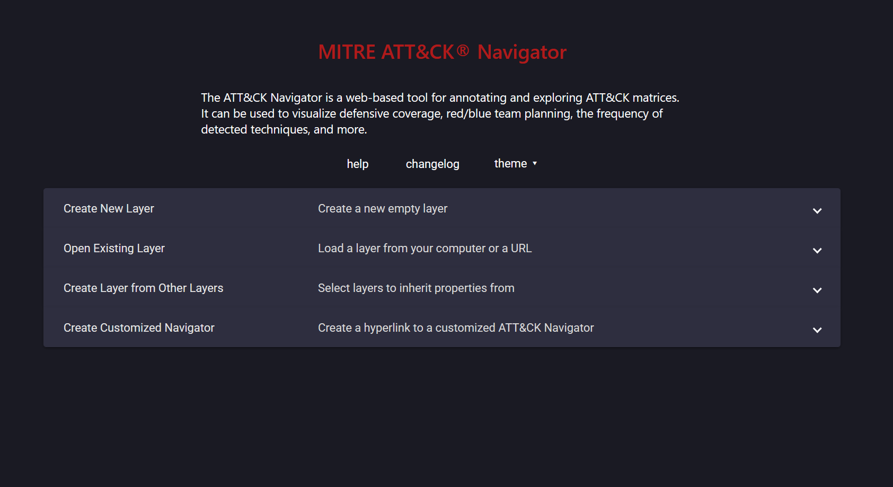
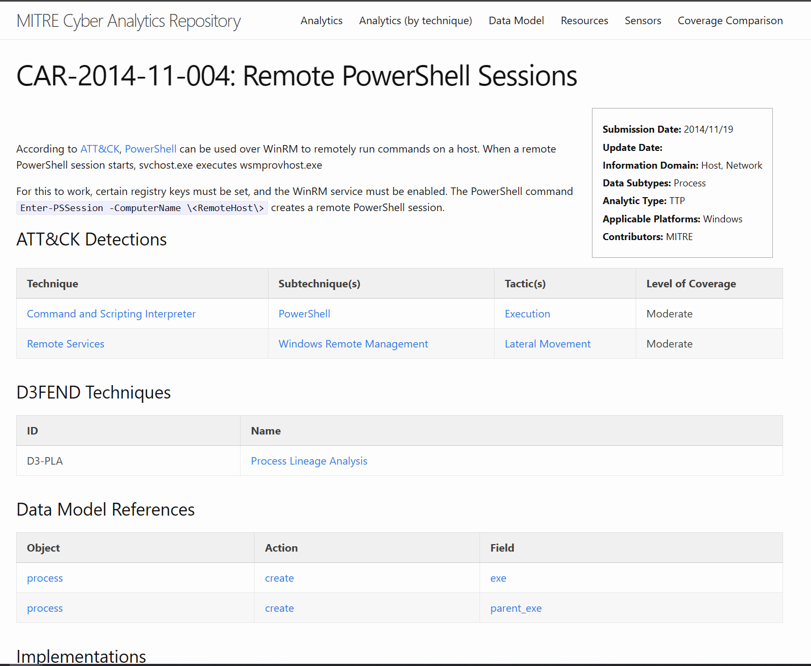

# Cyber Defence Frameworks (MITRE ATT&CK)

## Overview
This project explores the MITRE ATT&CK framework and its role in modern SOC operations. It covers how ATT&CK organizes adversary behavior into tactics and techniques and why this framework is widely used across defensive security teams.

---

## 1. Objective
Demonstrate the ability to analyze attacker activity and map observed behavior to MITRE ATT&CK tactics and techniques during a security investigation.

---

## 2. MITRE and ATT&CK Background

### MITRE
MITRE is an organization that develops frameworks and tools commonly used by security teams. Its work is widely referenced across SOCs, threat intelligence and security operations.

### MITRE ATT&CK
MITRE ATT&CK is a framework that documents common attacker behaviors observed in real-world incidents. SOC analysts use it to describe what attackers are doing and where activity fits in the attack lifecycle.

Common uses include:
- Adding context to alerts
- Mapping observed behavior during investigations
- Supporting detection and response planning

---

## 3. Core ATT&CK Concepts

MITRE ATT&CK organizes adversary behavior using three core concepts:

- **Tactics**  
  What the attacker is trying to achieve.

- **Techniques**  
  How the attacker does it. Each technique has a unique ID.

- **Procedures**  
  How a technique is carried out in practice (tools, malware, or threat groups).

This structure allows analysts to describe attacks in a clear and consistent way.

*Example ATT&CK technique page used to review attacker behavior.*

---

## 4. ATT&CK Matrix and Navigator

### ATT&CK Matrix
The ATT&CK Matrix shows tactics across the top and techniques beneath each tactic. It helps analysts see how activity fits within the overall attack lifecycle.

*ATT&CK Matrix view showing tactics and techniques.*

### ATT&CK Navigator
The ATT&CK Navigator is used to:
- Highlight techniques associated with a threat group
- Visualize attack paths
- Review detection coverage across tactics

SOC teams commonly use the Navigator during investigations, threat research, and post-incident reviews.

*Example ATT&CK Navigator view with techniques mapped during analysis.*

---

## 5. Mapping Threat Intelligence to ATT&CK

### Why Mapping (connecting information) Matters
**Threat intelligence** by itself is just information.  
**Mapping** organizes that information so analysts can:

- Standardize how attacks are described
- Add meaningful context to alerts
- Prioritize alerts
- Translate intelligence into detections and response actions
- Communicate clearly across teams

### Example Use Case
When analyzing activity linked to a known threat group, analysts may map behavior such as:
- Phishing based initial access
- Persistence activity
- Defense evasion
- Command-and-control traffic

Mapping threat intelligence means aligning threat information with frameworks like MITRE ATT&CK to understand attacker behavior and guide detection and response.

---

## 6. ATT&CK in SOC Operations

ATT&CK is used across security roles in the following ways:

- **SOC Analysts**: map alerts to tactics and techniques for triage and prioritization  
- **Threat Intelligence**: map observed behavior to profile threats  
- **Detection Engineering**: align detections with ATT&CK techniques  
- **Incident Response**: track and visualize attack progression

---

## 7. MITRE CAR (Cyber Analytics Repository)

MITRE CAR focuses on **detection**, not just attacker behavior.

CAR is a collection of example detection analytics that are mapped to MITRE ATT&CK techniques. Each analytic describes:
- What behavior to look for in logs
- Why that behavior matters
- Which ATT&CK technique it relates to
- The defensive value of detecting it

CAR helps bridge the gap between ATT&CK concepts and real world detections.

Many CAR analytics include example logic or sample queries (often Splunk style), showing how ATT&CK techniques can be translated into practical SIEM detections.

*Example MITRE CAR analytic mapped to an ATT&CK technique.*

---

## 8. MITRE D3FEND (Defensive View)

### D3FEND Overview
MITRE D3FEND focuses on defensive techniques and countermeasures. It provides a structured way to describe how security controls detect, deny, or disrupt attacker activity.

### ATT&CK and D3FEND Together
Using both frameworks together allows defenders to understand:
- What the attacker is doing (ATT&CK)
- How defenders can respond or mitigate it (D3FEND)

---

## 9. Key Takeaways
- MITRE ATT&CK provides a common language for describing attacker behavior  
- Mapping activity to ATT&CK adds clarity and context to SOC investigations  
- ATT&CK is widely used across SOC, CTI, detection engineering and incident response  
- MITRE CAR helps translate ATT&CK techniques into real detections  
- MITRE D3FEND complements ATT&CK by focusing on defensive controls  
