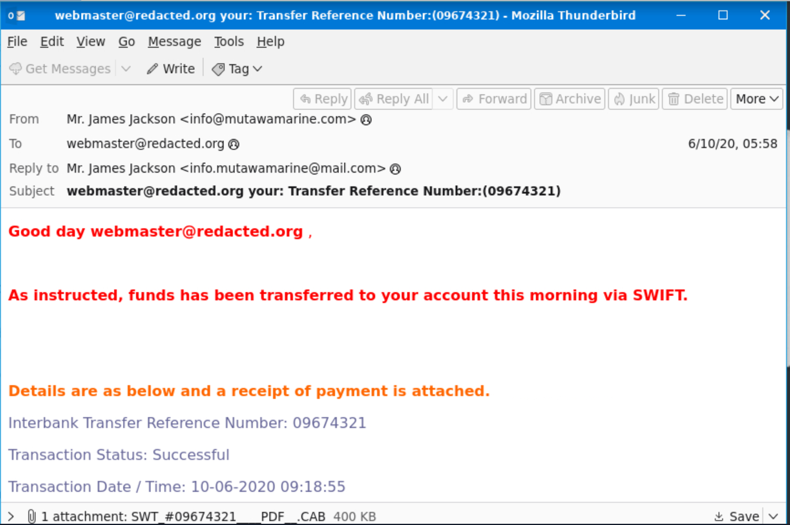
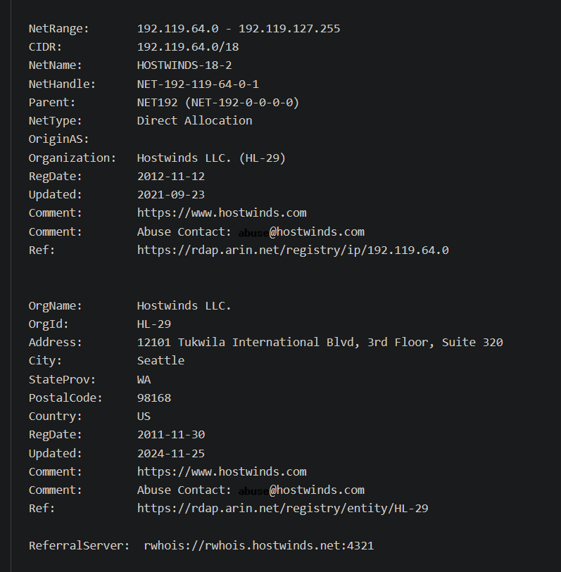
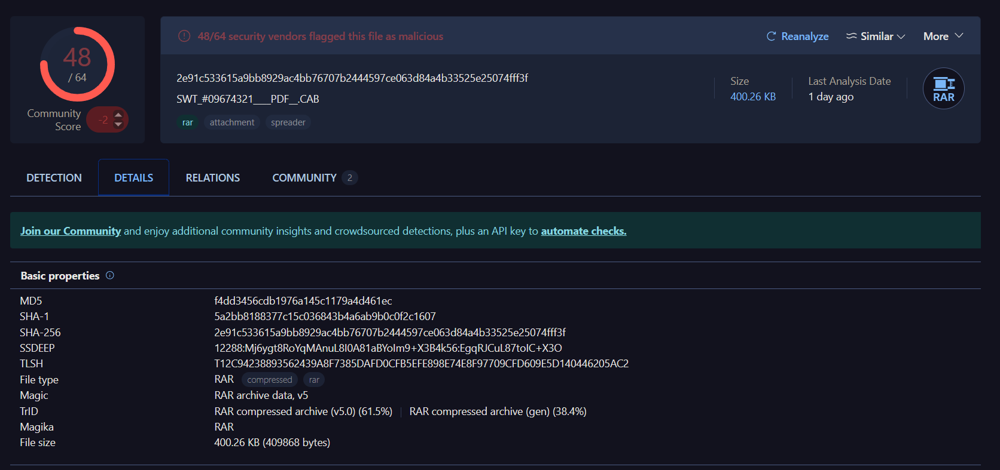

# Phishing Analysis – Greenholt Scenario

## Summary
A financial-themed email claiming to reference a wire transfer was reviewed to determine whether it was real.
The message was confirmed to be a phishing attempt intended to deliver a malicious attachment.

---

## Key Findings (red flags)

- The sender claimed to be from `mutawamarine.com`, but replies were redirected to a different domain, which is a strong sign of impersonation.

- The originating IP resolved to a generic hosting provider rather than real corporate mail infrastructure.

- The attachment looked like a PDF but was actually a compressed RAR archive, a common trick used to deliver malware.

- The email used a fake wire transfer to pressure the recipient into opening the attachment quickly.

---

## Conclusion
**Confirmed phishing email (malware delivery attempt).**

Taken together, the sender behavior, infrastructure mismatch, and deceptive attachment format clearly point to malicious intent.

---

## Recommended Actions
- Block the sender domain and originating IP  
- Block the attachment hash and similar file patterns  
- Advise users to report unexpected financial transfer emails  

---

## Takeaway
This scenario shows how phishing emails can look real at first glance, and how small details such as reply to behavior and attachment format are often what make the difference when reaching a confident conclusion.
